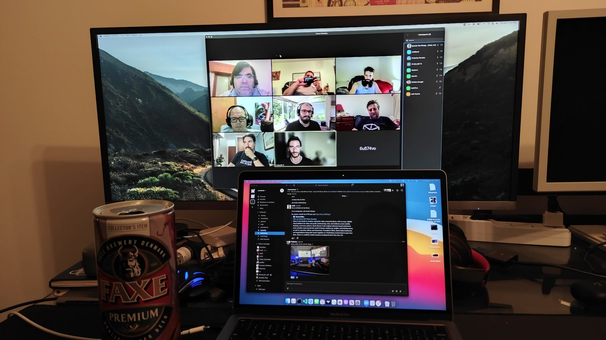

Hace unos días convocamos por Twitter para hacer nuestra primer Adminbirras virtual por Zoom. Este chapter, ya tuvo una experiencia presencial en Diciembre de 2020 pero por el aumento de casos de COVID en Uruguay, no nos quisimos arriesgar, así que decidimos juntarnos de manera virtual.
 
Lo bueno del caso es que se conectó gente de varios lugares. Tuvimos un infiltrado de Argentina, un loco de Salto y un Uruguayo perdido y asustado por una alerta de Tsunami en Nueva Zelanda.
 

 
Estuvimos poco más de hora y media hablando y conociéndonos. Esperemos que pronto, podamos hacer una juntada presencial, así que estate atento a este blog, twitter y el canal de SysArmy Ur

[Twitter](https://twitter.com/sysarmyuy)
[Slack](https://nerdearla.slack.com/archives/C01AF529AJZ/p1615464198000800)